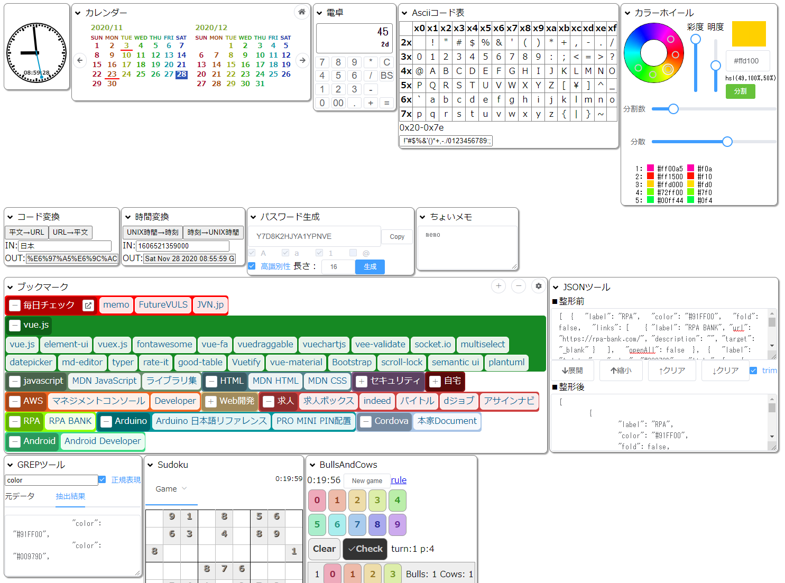

# vue-portal2
Simple portal service.

To develop.
> yarn dev

To build.
> yarn build

## 機能

* ブラウザ用のポータル画面を提供する。
* 設定はローカル・ストレージに保存されるため、ブックマーク情報がネット上を流れない。

### 設定

* 画面右上の歯車マークをクリックすると表示コンポーネント設定ダイアログが開く。
* チェックを外したコンポーネントは表示されない。
* コンポーネントをドラッグすると表示順が変更される。
 
## コンポーネント

### 時計

* 時刻が表示される。

### カレンダー

* 当月、翌月のカレンダーが表示される。
* 日本の休日は下線を引かれる。
* 当日は反転表示される。
* 左右の矢印をクリックすると表示月が変更される。
* 右上のホームボタンをクリックすると当月が表示される。

### ブックマーク

* 登録されたカテゴリー別にブックマークが表示される。
* ブックマークをクリックすると別画面（ターゲットが_blankの場合）で表示する。
* ブックマークには表示名、URL、タイトル（カーソルをリンクに乗せると表示される）、説明（編集画面で見る）、ターゲットが設定できる。
* ブックマークはカテゴリーにまとめることができる。
* カテゴリーには表示名、背景色、まとめて開くかどうかを指定することができる。
* カテゴリー名横の＋ボタンで開くことができる。
* カテゴリー名横の－ボタンで閉じることができる。
* 右上の＋ボタンですべてのカテゴリーを開く。
* 右上の－ボタンですべてのカテゴリーを閉じる。
* 右上の歯車ボタンで編集モードに遷移する。
* カテゴリーに「まとめて開く」を設定した場合、カテゴリー名横の開くボタンでブックマークを一度に表示する。
* 編集モードでは、＋カテゴリー追加ボタンでカテゴリーを追加できる。
* 編集モードでは、カテゴリーの＋ボタンでブックマークを追加できる。
* 編集モードでは、カテゴリー名横の編集ボタンでカテゴリーの設定を編集できる。
* 編集モードでは、ブックマーク名横の編集ボタンでブックマークの設定を編集できる。
* 編集モードでは、JSONデータボタンで設定のJSON情報を直接編集できる。
* 編集モードでは、右上の歯車ボタンで通常モードに遷移する。
* 設定した内容はブラウザのローカル・ストレージに保存される。

### 計算機

* 計算機が表示される。

### JSON変換

* JSON形式テキストの成形ツールが表示される。

### Ascii表

* ASCIIコード表が表示される。

### URL変換

* URL変換ツールが表示される。

### UNIX時間変換

* UNIX時間変換ツールが表示される。

### カラーホイール

* カラーホイール・ツールが表示される。

### grep

* grepツールが表示される。

### ちょいメモ

* ちょいメモ・ツールが表示される。

### 毎日チェック

* 毎日1度ボタンをクリックした時刻を確認するツールが表示される。

### パスワード生成

* パスワード生成ツールが表示される。

### ナンプレ

* ナンプレが表示される。

### Bulls and Cows

* Bulls and Cowsが表示される。
 
# vue-portal1
Simple portal service.

To develop.
> npm run serve

To build.
> npm run build

## 機能

* ブラウザ用のポータル画面を提供する。
* 設定はローカル・ストレージに保存されるため、ブックマーク情報がネット上を流れない。

### 設定

* 画面右上の歯車マークをクリックすると表示コンポーネント設定ダイアログが開く。
* チェックを外したコンポーネントは表示されない。
* コンポーネントをドラッグすると表示順が変更される。
 
## コンポーネント

### 時計

* 時刻が表示される。

### カレンダー

* 当月、翌月のカレンダーが表示される。
* 日本の休日は下線を引かれる。
* 当日は反転表示される。
* 左右の矢印をクリックすると表示月が変更される。
* 右上のホームボタンをクリックすると当月が表示される。

### ブックマーク

* 登録されたカテゴリー別にブックマークが表示される。
* ブックマークをクリックすると別画面（ターゲットが_blankの場合）で表示する。
* ブックマークには表示名、URL、タイトル（カーソルをリンクに乗せると表示される）、説明（編集画面で見る）、ターゲットが設定できる。
* ブックマークはカテゴリーにまとめることができる。
* カテゴリーには表示名、背景色、まとめて開くかどうかを指定することができる。
* カテゴリー名横の＋ボタンで開くことができる。
* カテゴリー名横の－ボタンで閉じることができる。
* 右上の＋ボタンですべてのカテゴリーを開く。
* 右上の－ボタンですべてのカテゴリーを閉じる。
* 右上の歯車ボタンで編集モードに遷移する。
* カテゴリーに「まとめて開く」を設定した場合、カテゴリー名横の開くボタンでブックマークを一度に表示する。
* 編集モードでは、＋カテゴリー追加ボタンでカテゴリーを追加できる。
* 編集モードでは、カテゴリーの＋ボタンでブックマークを追加できる。
* 編集モードでは、カテゴリー名横の編集ボタンでカテゴリーの設定を編集できる。
* 編集モードでは、ブックマーク名横の編集ボタンでブックマークの設定を編集できる。
* 編集モードでは、JSONデータボタンで設定のJSON情報を直接編集できる。
* 編集モードでは、右上の歯車ボタンで通常モードに遷移する。
* 設定した内容はブラウザのローカル・ストレージに保存される。

### 計算機

* 計算機が表示される。

### JSON変換

* JSON形式テキストの成形ツールが表示される。

### Ascii表

* ASCIIコード表が表示される。

### URL変換

* URL変換ツールが表示される。

### UNIX時間変換

* UNIX時間変換ツールが表示される。

### カラーホイール

* カラーホイール・ツールが表示される。

### grep

* grepツールが表示される。

### ちょいメモ

* ちょいメモ・ツールが表示される。

### 毎日チェック

* 毎日1度ボタンをクリックした時刻を確認するツールが表示される。

### パスワード生成

* パスワード生成ツールが表示される。

### ナンプレ

* ナンプレが表示される。

### Bulls and Cows

* Bulls and Cowsが表示される。
 
